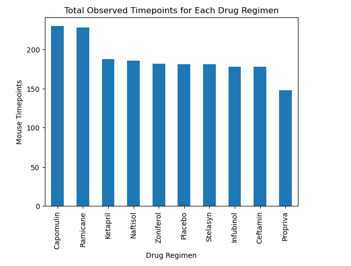
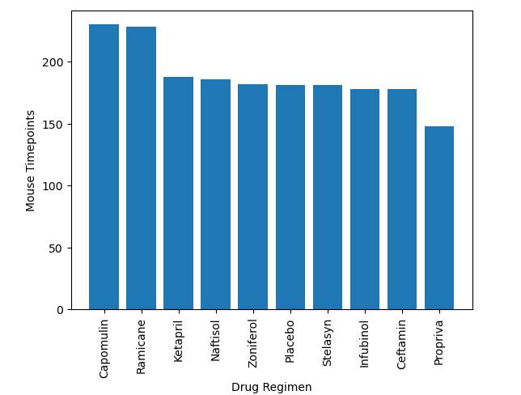
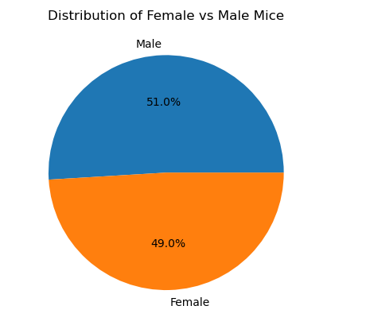
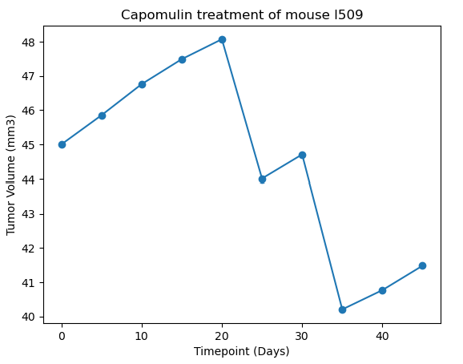
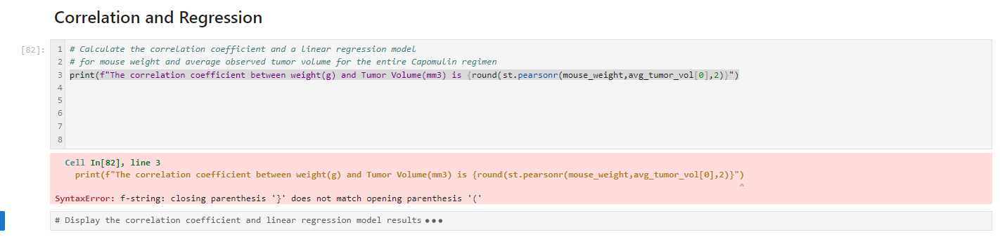
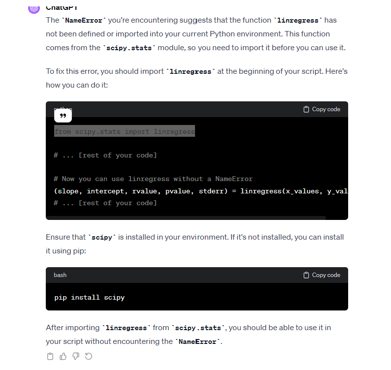
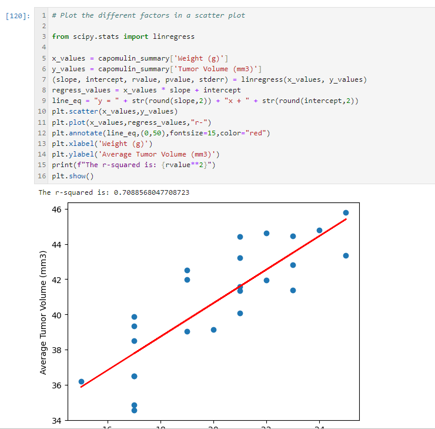

# Unit 5 Homework: The Power of Plots

## Homework requirement:
*Review all the figures and tables that you generated in this assignment. Write at least three observations or inferences that can be made from the data. Include these observations at the top of your notebook.* 
---

### Observations from the plots:

1. Both Python and Matplotlib can achieve the same analysis visual result. 

I created two bar charts called "Total observed timepoints for each drug regimen" with the use of Pandas and of Matplotlib. The plots run are nearly identical, indicating the same analysis result. I personally prefer Pandas way, as the language is simpler. 

2. The bar charts indicate that Capomulin and Ramicane are the two regimen with the most observed mouse timepoints. 

3. The pie chart indicates that male mice and female mice are selected equaly, therefore the sex factor does not need to be considered, when evaluating the running result.

4. We can draw conclusion from the below plots. At the very begining, the tumor volume appears to increase, reaching a peak before starting to decrease significantly. After the peak around day 20, there's a sharp decline in tumor volume, suggesting that the treatment may have started to take effect since day 20th. 

5. The regression plot indicates that:
   1. There is a positive correlation between mouse weight and average tumor volume.
   2.  The strength of this relationship is fairly strong given the R-squared value, which implies that weight is a good predictor of tumor volume in this context.
   

**Note: How did I struggle with a bug but finally worked it out?**

When I tried to make a regression plot, I had bugs as below.

So I checked all the coding and compared with the class activities' coding, and did not know what caused the bug. 

Then I inquired with ChatGPT, and it reminded me that whether I installed scipy that I already finished the installation, and that whether I run the scipy.stats environment, by adding "From scripy.stats import linregress" 

Therefore, I finally made it!!!!!!

